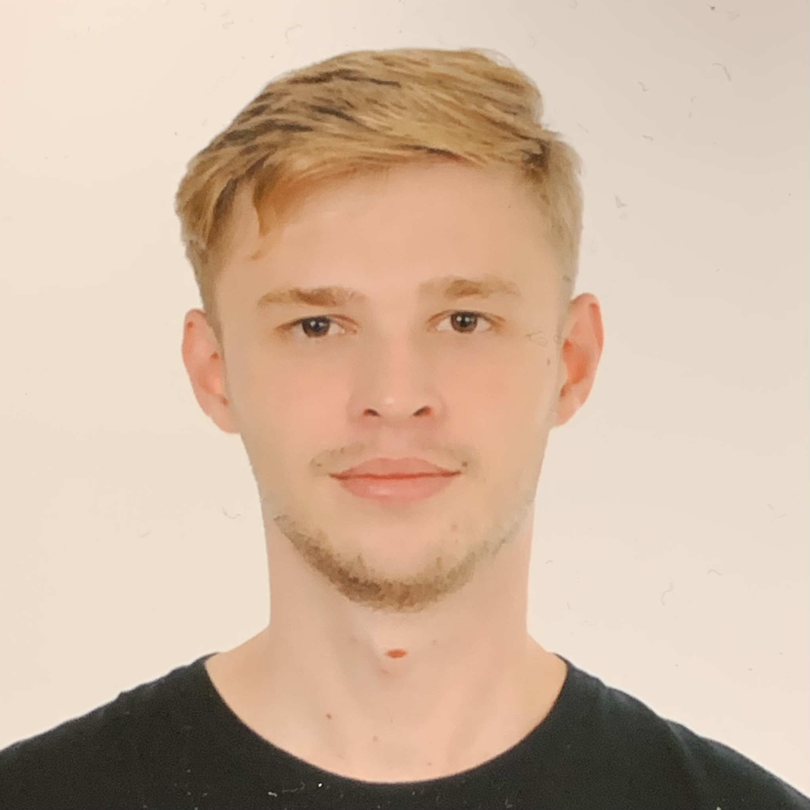

 

 

  

    
  

  

    

      <h4>Leonardo Novicki Neto</h4>
    

    

      

    
    With a bachelor's degree in physics from the Federal University of Paraná (UFPR). The development of the TWICE Dataset is part of his master's thesis. He is pursuing his master's degree in the Department of Electrical Engineering at the UFPR under the supervision of Prof. Dr. Eduardo Parente Ribeiro. However, the dataset's development took place during his time at Technische Hochschule Ingolstadt (THI) under the supervision of Prof. Dr.-Ing. Werner Huber.

    

  

[CV Lattes](https://wwws.cnpq.br/cvlattesweb/PKG_MENU.menu?f_cod=995FEADB51559C266842BC8EE7C48DDA#)

  

    
  

  

    

      <h4>Fabio Reway</h4>
    

    

      

    
    Fabio description

    

  

  

    
  

  

    

      <h4>MsC. Yuri Poledna</h4>
    

    

      

    
    Yuri description

    

  

  

    
  

  

    

      <h4>MsC. Maikol Funk Drechsler</h4>
    

    

      

    
    Maikol description

    

  

  

    
  

  

    

      <h4>Prof. Dr. Eduardo Parente Ribeiro</h4>
    

    

      

    
    Parente description

    

  

  

    
  

  

    

      <h4>Prof. Dr.-Ing. Werner Huber</h4>
    

    

      

    
    Werner description

    

  

[Werner THI](https://www.thi.de/en/carissma/personnel/prof-dr-werner-huber/)